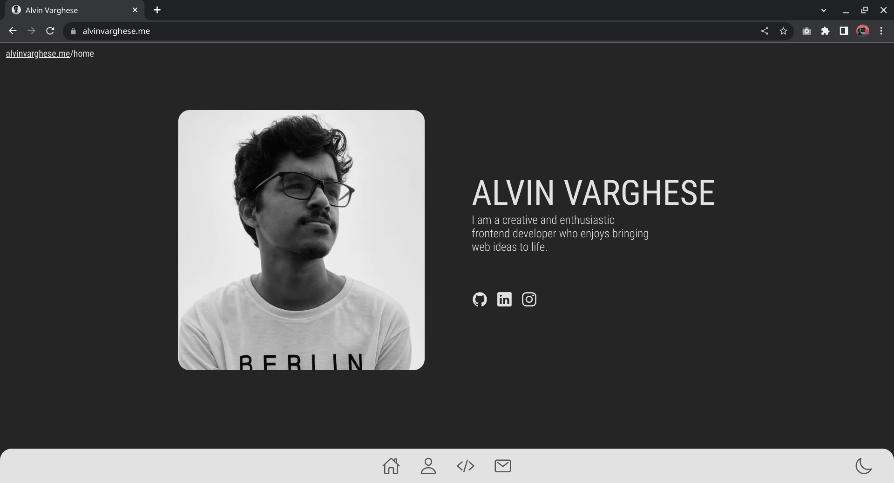

# My Portfolio Website

Have a look at it: [alvinvarghese.me](https://alvinvarghese.me)

## Table of Contents

- [ About](#getting_started)
- [ Installing](#installing)

## About

Designed with `Figma`, Developed by `Next Js` in `Typescript`. Uses dependencies `Email Js` to send emails, `Ionic Icons` for icons. Deployed in Vercel.

## Installing
- Clone the repository
- Once you've created a project folder, install dependencies with `npm install`
- To start the development server and open the app in a new browser tab, enter `npm run dev`

